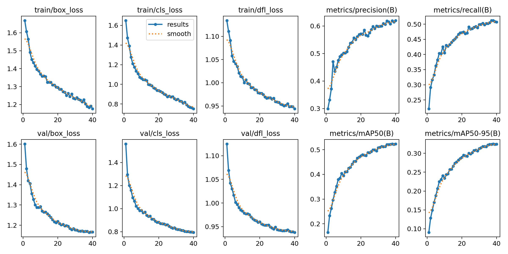
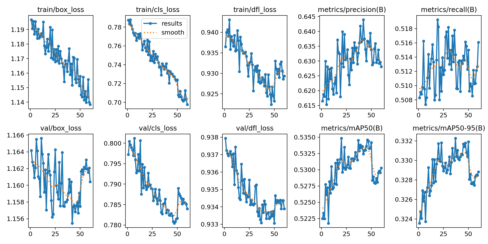
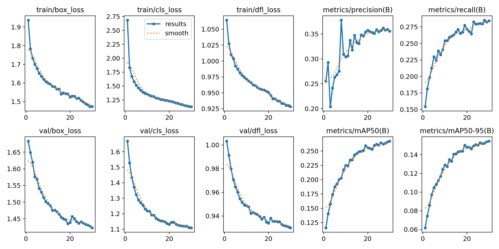

# Drone Vision MVP (VisDrone Object Detection) 

Ссылка (если до сих пор хостится): https://cv-detection-visdrone-project.streamlit.app/

Прототип ML-приложения для распознавания объектов на изображениях, снятых с (дронов.
Реализован сайт на streamlit с следующим функционалом:
1. Загрузка изображения
2. Выбор модели для детекции
3. Выбор классов для детекция
4. Вывод изображения с bbox
5. Вывод графиков обучения модели

# Видео-тест MVP

---

## Результаты обучения

Модель **YOLOv8 Medium** была обучена в облаке на 40 эпохах с разрешением `imgsz=1024`.
* **mAP50:** 0.534
* **mAP50-95:** 0.332

**Первые 40 эпох обучения**

**Дообучение еще 60 эпох. Столкнулись с переобучением на ~50 эпохе**

Модель **YOLOv8 Nano** была обучена в облаке на 30 эпохах с разрешением `imgsz=640`.
* **mAP50:** 0.26 
* **mAP50-95:** 0.156

---

## Как запустить веб-интерфейс локально:
1. Установите датасет https://www.kaggle.com/datasets/kushagrapandya/visdrone-dataset/data
2. Установите зависимости: `pip install -r requirements.txt`
3. Подготовьте данные - скрипт convert_visdrone
4. Обучите модели - скрипты train_easy_model (обучал на GTX 3050 4gb Laptop 2ч) train_hard_model_on_kaggle (обучал на T4 15gb x2 10ч)
5. Скачайте обученные веса в папку `models/`
6. Запустите веб-интерфейс: `streamlit run src/app.py`
